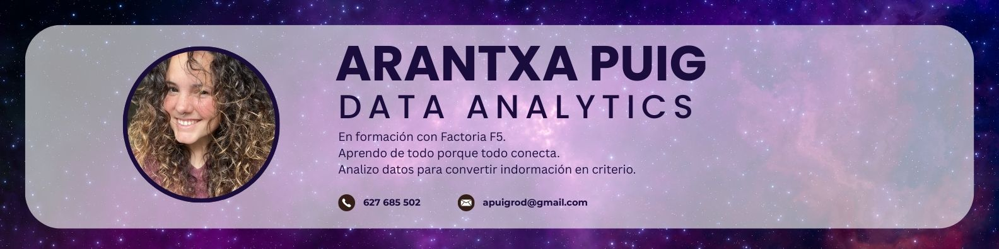

# Learning the rules. Building my own. 💜

Amante del café ☕, los libros 📚 y los perros 🐶

## 🧠 Sobre mi
No colecciono cursos.   
Colecciono preguntas.

Estoy formándome como Data Analyst, pero más allá de aprender herramientas, me interesa entender cómo los datos influyen en decisiones reales.

Porque los números no hablan solos.   
Hay que saber escucharlos.

---
## 📊 Qué estoy aprendiendo

### 🚀 Stack & Skills   

*Todo mientras pruebo, me equivoco y ajusto... así es como se aprende de verdad*.

--- 

## 🎯 Mi forma de trabajar

Curiosidad amplia.
Enfoque analítico.
Aprender de los errores.
Construir criterio con cada proyecto.

**Creo en el aprendizaje constante**

---

## 🚀 Qué encontrarás aquí

Proyectos reales en formación, experimentos con datos y procesos documentados.

Nada perfecto.  
Todo intencional.

----

## 📌 En progreso...

Este perfil crece conmigo.

### ✨ *Si hoy estoy aprendiendo reglas. mañana estaré construyendo las mías*

